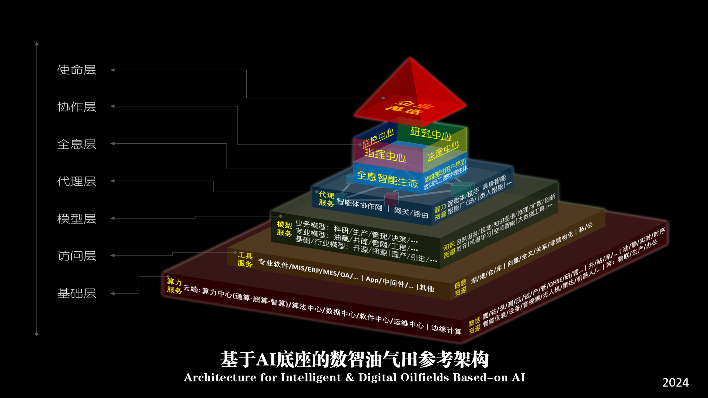

# 基于AI底座的数智油气田参考架构
# Architecture for Intelligent & Digital Oilfileds Based-on AI

王权 2024.12.29

2024年12月29日，在石油圈-能源说线上讲座《探索以AI为底座的企业数智化大系统新范式》中，王权首次以油气田数智化为例提出“基于AI底座的数智油气田参考架构”。该架构可视为其于2003年提出的“数字油田参考架构”的升级版。

----------

## 1 大系统观哲学思想
新的基于AI底座的数智油气田参考架构更加突出了大系统思维，建立了主客体互动的主谓宾格清晰的大系统逻辑哲学范式：
### 主格/主体
油气田企业，以及人，作为系统主体，承载着系统的使命——企业再造——数字化转型与智能化发展；
### 宾格/客体
油气田企业实体、AI智能体，自下而上的数据资源、信息资源、知识资源、智力资源，以及数字孪生体和虚拟员工；
### 谓格/工具
主体操作客体所使用的算力服务、工具服务、模型服务、代理服务，以及全面支持主体行为的全息智能生态。

## 2 架构层次
基于AI底座的数智油气田参考架构共分为7层，分别是基础层、访问层、模型层、代理层、全息层、协作层和使命层。

### 基础层
这是架构的底层，包括了各种数据资源和计算资源。数据资源涵盖了油气田运营中，由各种设备和仪器以及人工采集的、各种形式的原始数据，包括各类井站场的各种动静态与实时时序数据，如地震数据、钻井数据、录井数据、测井数据、压裂数据、测试数据、生产数据、QHSE（质量、健康、安全、环境）数据、研究数据和运营数据等。这些数据通过现场物联网、生产网和办公网传输到相应位置。计算资源则包括算力中心（云端的通用计算、专业软件高性能计算、人工智能专用计算，以及存储和网络传输能力）、算法中心、数据中心、软件中心、运维中心以及边缘计算等。

### 访问层
这一层提供了对基础层资源的访问接口，包括专业软件（如MIS、ERP、MES、OA等），以及各种App、中间件和其他工具服务。这些服务调用数据湖、数据仓库、数据港口中的信息资源，完成指定任务。根据产权所属，数据可分为私有和公有等种类；根据存储方式，数据可分为结构化和非结构化，以及关系型数据库、向量数据库、全文检索数据库等。不同的数据既是系统必须面对的客观存在，也是完成各种服务任务的保障。

### 模型层
在这一层，通过模型服务为上层调用提供响应。需要构建由业务模型、专业模型和基础/行业模型组成的多层次模型体系。首先要根据油气田自身情况采用国内外的或开源或闭源的基础大模型，建立本领域或行业的大模型；然后，基于基础/行业模型，建立满足不同专业需求的专业模型，还要建立油藏、井筒、管网、工程等各方面的面向具体技术节点的模型；最后，还要建立直接面向业务的模型，为科研、生产、管理、决策等提供服务。这些大小模型通过调用自然语言处理、视觉、知识图谱、推理、扩散、创新、对齐、机器学习、空间智能、大数据工具以及其他各种模型和算法，利用知识资源实现任务目标。

### 代理层
这一层由智能体等为人提供代理服务。处在不同层级、具有不同功能、角色的众多智能体将链接成为组群，组成智能体协作网，实现了智能体、助手、具身智能等相互之间的智能化联动和合作。人通过连接一个或少数智能体，就可以获得期望的结果。如果所连接的智能体无法满足人提出的需求，那它将通过自动网关或路由找到能够解决问题的其他智能体，并请求完成相关任务，在全部工作完成后，与人连接的智能体将把任务执行结果反馈到人。

### 全息层
在这一层，建立一个基于油气田全息数字孪生体的信息通畅、数据及时准确、用户界面自然友好的全息智能生态。通过全息智能生态，人可以和人工智能体——虚拟员工，形成主从关系的协作联合体，以人的思维驱动的意志为主，以人工智能体的系统意志为辅，掌握和运用好油气田生产科研、经营管理和战略决策的全息，实现对油气田全生命周期的高效智能管理。

### 协作层
在这一层，实现人机共治。人与AI共同管理油气田，人工智能全面支撑和共同运营油气田各级的指挥中心、决策中心、监控中心、研究中心。必须保障人作为油气田运营的最重要参与者和最终决策者。

### 使命层
这是架构的顶层，代表了企业的战略和使命，是整个架构的指导思想和最终目标。数字化转型和智能化发展，就是企业系统的一次再造过程，是企业系统结构的重大调整和改变。领导、执行和参与这次企业再造的每一个人都需要具备大系统观。

## 3 实践指导
基于AI底座的数智油气田参考架构，是一套完整的油气田数字化转型和智能化发展的战略思想，它可以为企业未来一段时期的数智化建设提供理论和实践指导，以及一系列的具体实施方案的设计和建设思想基础，主要包括：数据的采集、处理、分析、挖掘、服务、治理、运营等，以及新一代信息技术生态、新型用户界面、数字孪生体、AI系统及智能体的设计、开发与应用，乃至包括人力资源在内的全部信息系统资源的整合、优化、保障等等各方面。

但是，此参考架构并不是可立即落地的技术框架或实施方案，它只是一个方法论层面的指导性框架。就像当年（1999-2003年）的数字油田参考架构一样，这个新的参考架构需要结合具体的业务需求、技术条件、组织架构、管理制度等多方面因素，才能真正落地到具体的实施方案。 当年解释数字油田参考架构时所说：参考架构相当于ISO-OSI的7层网络协议，它只是一种理论框架，并不是具体的实施方案，而TCP/IP的4层协议才是具体的实施方案。如今，对基于AI底座的数智油气田参考架构而言，也同样可以这么说。

各油气田应该结合自身的实际情况，制定适合自己的数智油气田建设架构和实施路线。如果完全照抄照搬这个参考框架，那可能是不现实的，实现难度太大，甚至可能导致实践失败。一般情况下，各油气田的建设架构和实施路线可以在此基础上进行简化和优化，而且也不应局限于此参考架构的表现形式。例如，大庆油田就是在此参考架构基础上，经过简化优化，制定并实施以IONE和油博士/页博士为技术平台和应用核心的技术架构，构建基于AI的新一代数智油田大系统。

----------

 

**`大同数智 和而不同`**
  